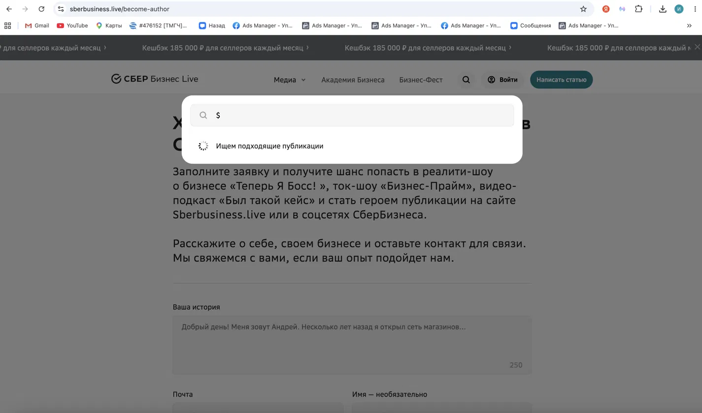
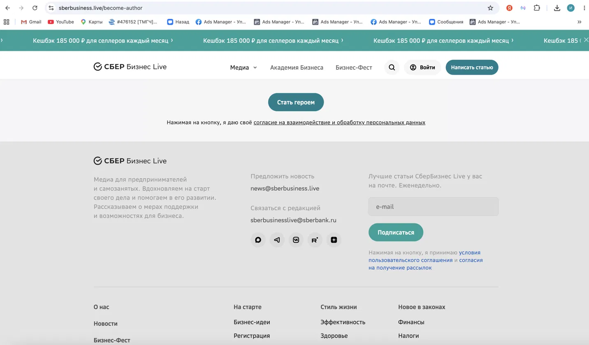
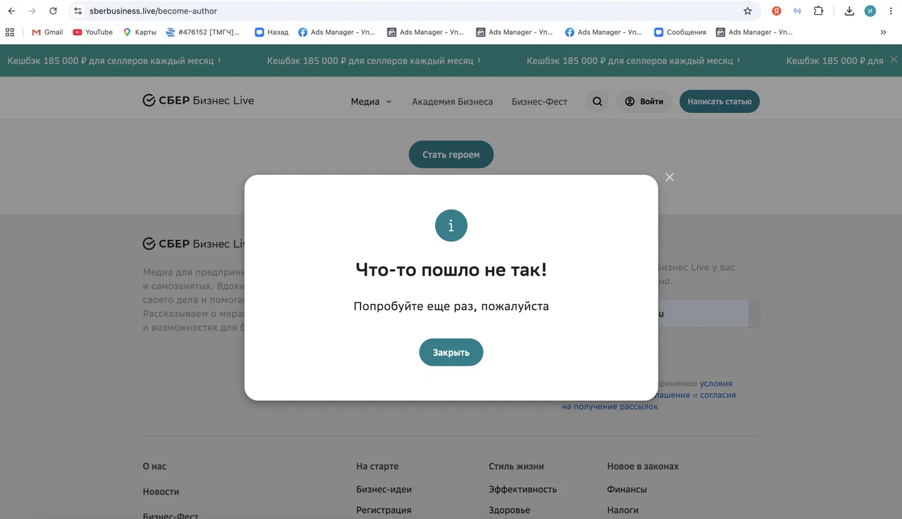

# Баг-репорты: sberbusiness.live

**Дата тестирования:** июль 2026
**Окружение:** Chrome (последняя версия), macOS, разрешение 1440×900
**Найдено дефектов:** 3

---

## BUG-01

| Поле | Значение |
|---|---|
| **ID** | BUG-01 |
| **Заголовок** | Поиск по сайту не завершается (зависает) при вводе спецсимвола `$` |
| **Критичность (Severity)** | Значительная |
| **Приоритет (Priority)** | Высокий |
| **Статус** | Открыт |
| **Компонент** | Поиск по сайту (модальное окно поиска в шапке) |
| **Тестовая среда** | Chrome (последняя версия), macOS, 1440×900 |
| **Шаги воспроизведения** | 1. Открыть сайт [sberbusiness.live](https://sberbusiness.live)   2. Нажать на иконку поиска (лупа) в шапке сайта   3. Ввести в поле поиска символ `$`   4. Дождаться результата поиска |
| **Ожидаемый результат** | Поиск завершается в течение 3–5 секунд. Отображается сообщение «Ничего не найдено» или пустой список результатов |
| **Фактический результат** | Отображается индикатор загрузки «Ищем подходящие публикации». Поиск не завершается более 1 минуты, результат или сообщение об ошибке не выводится |
| **Вложения** |  |

---

## BUG-02

| Поле | Значение |
|---|---|
| **ID** | BUG-02 |
| **Заголовок** | Отсутствует сообщение об ошибке при отправке формы подписки с пустым полем email |
| **Критичность (Severity)** | Незначительная |
| **Приоритет (Priority)** | Низкий |
| **Статус** | Открыт |
| **Компонент** | Форма подписки на рассылку (футер) |
| **Тестовая среда** | Chrome (последняя версия), macOS, 1440×900 |
| **Шаги воспроизведения** | 1. Открыть сайт [sberbusiness.live](https://sberbusiness.live) и прокрутить страницу до футера   2. Убедиться, что поле email пустое   3. Нажать кнопку «Подписаться» |
| **Ожидаемый результат** | Отображается сообщение об ошибке вида «Поле обязательно для заполнения». Пользователь понимает, что нужно ввести email |
| **Фактический результат** | Ничего не происходит: сообщение об ошибке не появляется, визуальной реакции на нажатие кнопки нет, форма не отправляется |
| **Вложения** |  |

---

## BUG-03

| Поле | Значение |
|---|---|
| **ID** | BUG-03 |
| **Заголовок** | Форма подписки возвращает необработанную ошибку «Что-то пошло не так!» при отправке валидного email |
| **Критичность (Severity)** | Значительная |
| **Приоритет (Priority)** | Высокий |
| **Статус** | Открыт |
| **Компонент** | Форма подписки на рассылку (футер) |
| **Тестовая среда** | Chrome (последняя версия), macOS, 1440×900 |
| **Шаги воспроизведения** | 1. Открыть сайт [sberbusiness.live](https://sberbusiness.live) и прокрутить страницу до футера   2. Ввести в поле email валидный адрес формата `user@domain.ru`   3. Нажать кнопку «Подписаться» |
| **Ожидаемый результат** | Отображается подтверждение успешной подписки либо сообщение о необходимости подтвердить email в письме |
| **Фактический результат** | Появляется модальное окно с текстом «Что-то пошло не так! Попробуйте ещё раз, пожалуйста». Подписка не оформляется, текст ошибки не содержит информации о причине проблемы |
| **Вложения** |  |
