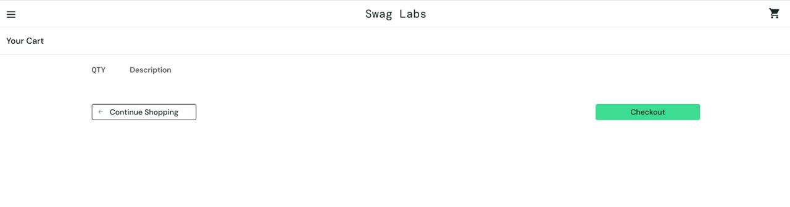
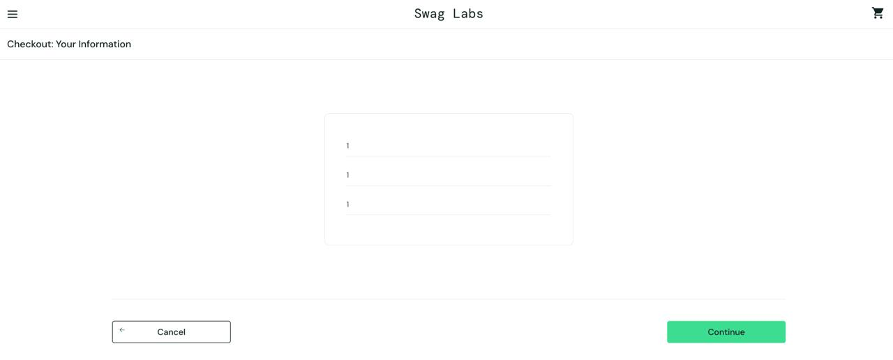
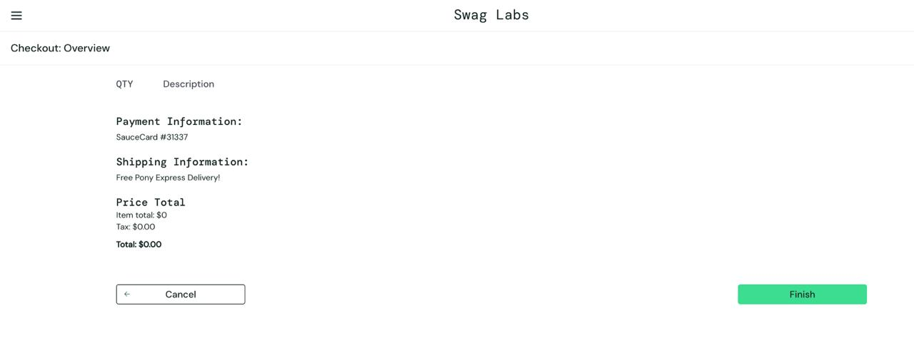

# Баг-репорт: Saucedemo

## Описание задачи

**Объект тестирования:** [saucedemo.com](https://www.saucedemo.com) — учебный интернет-магазин.

**Задача:** найти дефект в процессе оформления заказа (checkout) и составить баг-репорт.

**Окружение:** Chrome (последняя версия), macOS

**Найденный дефект:** система позволяет пройти все шаги оформления заказа и получить подтверждение покупки при пустой корзине.

---

## Баг-репорт

| Поле | Значение |
|---|---|
| **Заголовок** | Оформление пустого заказа приводит к thank-you page на странице завершения покупки при отсутствии товаров в корзине |
| **Критичность (Severity)** | Значительная |
| **Приоритет (Priority)** | Средний |
| **Шаги воспроизведения** | 1. Авторизоваться и добавить товар в корзину   2. Перейти в корзину и удалить все товары   3. Нажать «Checkout»   4. Заполнить поля и нажать «Continue»   5. Нажать «Finish» |
| **Ожидаемый результат** | Система выдаёт сообщение, что корзина пуста и для оформления заказа необходимо добавить товары в корзину |
| **Фактический результат** | Система даёт оформить заказ даже при пустой корзине и выводит thank-you page с сообщением об успешном оформлении заказа |
| **Вложения** | 

 |
